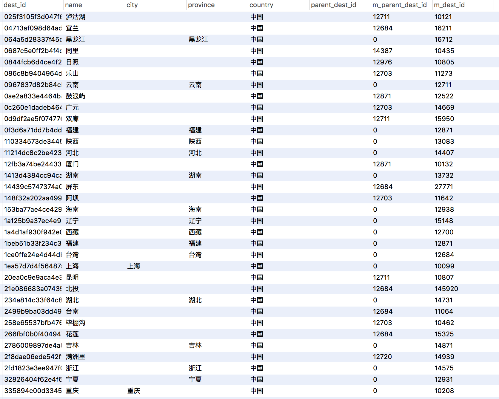

# 马蜂窝分布式爬虫系统

设计这个爬虫系统的主要目的是，完整快速地获取国内所有旅游目的地和旅游景点，包括名称、介绍、图片、相关攻略等。

主要使用到的技术（工具／语言／库）包括：Docker, Redis, MySQL, Python, requests, peewee等。

系统架构图：


MySQL和Redis是两个Docker容器，Redis负责保存系统运行过程中产生的数据，MySQL负责保存需要持久话的数据。ABCDE分别由单个或多个Docker容器组成，是主要的下载节点和逻辑处理节点。

1. 容器A获得全国的省份、直辖市和特别行政区信息，将对应ID和信息分别保存到Redis和MySQL
2. 容器集群B从Redis一直读取省份ID，根据省份ID从马蜂窝获取该省内的旅游目的地，并将目的地ID和信息分别保存到Redis和MySQL
3. 容器集群C从Redis一直读取目的地ID，根据目的地ID从马蜂窝获取该旅行目的地下所有的景点ID和概要信息，并将其分别保存到Redis和MySQL
4. 容器集群D从Redis一直读取景点ID，根据景点ID从马蜂窝获取该景点的具体信息，包括名称、介绍、门票、交通、图片等，并且把信息都存储到MySQL，把图片地址保存到Redis
5. 容器集群E从Redis一直读取图片地址，并将图片保存到本地(TODO)

容器A只工作一次，完成信息的获取之后自动停止。集群BCDE会一直工作，一直从Redis队列里读取信息，一旦获取到新的ID，就会开始下载和处理页面／图片，直到队列为空，重新回到等待状态。同一个集群内的容器所做的工作是一样的，容器数量可以根据需求随时扩展或缩小。

# 使用方式

下载程序
```
git clone https://github.com/0xHJK/mafengwo-crawlers
```

修改`src/common/chameleon.py`里的代理列表（因为代理具有时效性），代理获取方式可以参考：

<https://github.com/0xHJK/proxy-spider>

运行
```
docker-compose up
```

扩展节点数量（根据自己需要扩展）
```
#扩展获取城市列表节点为10个
docker-compose scale citylist=10

#扩展获取景点列表节点为20个
docker-compose scale citylist=20

#扩展获取景点信息节点为30个
docker-compose scale citylist=30
```

重新运行
```
docker-compose up
```

# 运行效果





